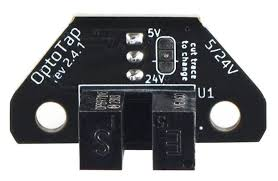

# OptoTap

The OptoTap uses optical sensing to precisely detect when a tool was touching the bed, enabling probing and useful features for a tool changer's such as detection for mounted tool, crashes and succesful tool change.

{: style="max-width: 400px; display: block; margin: 20px auto; border: 1px solid #999; border-radius: 8px; box-shadow: 0 2px 8px rgba(0,0,0,0.2);"}

!!! info "One Per Tool"
    You will need one OptoTap for every toolhead in your build. A 6-tool setup requires 6 OptoTap boards

## Resources

- [:fontawesome-brands-github: OptoTap GitHub Repository](https://github.com/VoronDesign/Voron-Tap/tree/main/OptoTap){:target="_blank"}
